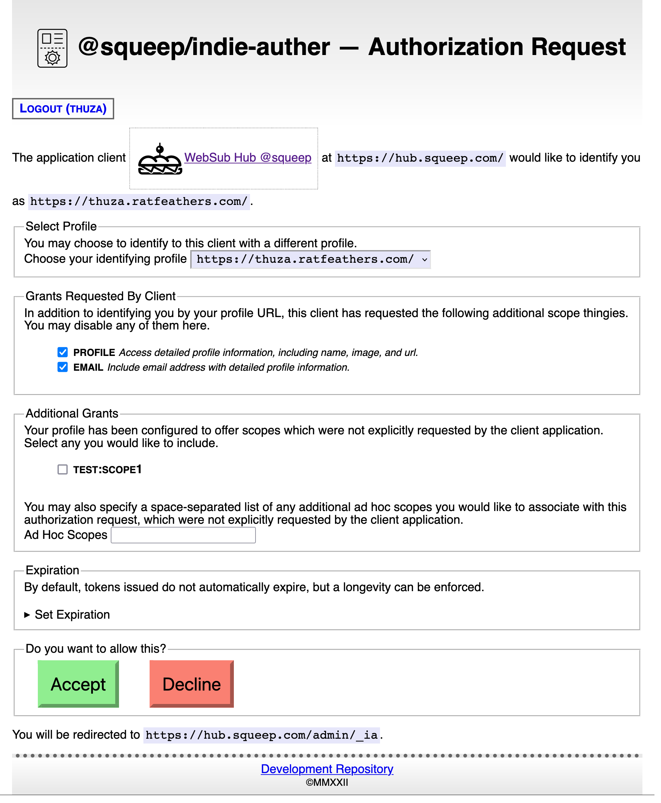
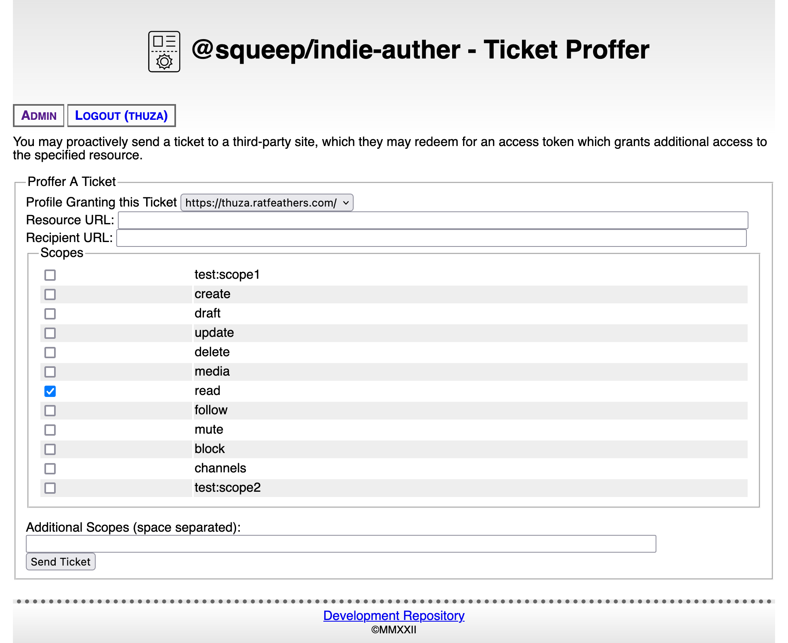
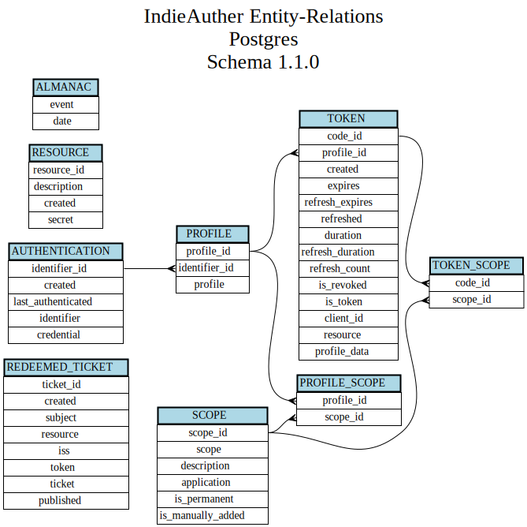

# Welcome to my IndieAuth-er

## What

[IndieAuth](https://indieweb.org/IndieAuth) is a [protocol](https://indieauth.spec.indieweb.org/) which facilitates identifying users uniquely by the URLs they control to third-party applications.  It is an extension of [Oauth 2](https://indieauth.spec.indieweb.org).

This service implements the functionality required to negotiate that identity authentication and validation.

## Let's Do Some Auth

A ```user``` is an entity known to this service, with a credential (currently a password) used to authenticate and login to this service.  
Authentication of a ```user``` is handled by either a [hashed password](https://en.wikipedia.org/wiki/Argon2) stored securely in one of the available database engines, or by optionally delegating to the host machine's [<abbr title="Pluggable Authentication Module">PAM</abbr> subsystem](https://en.wikipedia.org/wiki/Pluggable_Authentication_Modules).
PAM can be used to leverage, exempli gratia, LDAP integration for user authentication.

A ```profile``` is a URL (under control of a ```user```) which contents includes the necessary meta-data informing an application to contact this server for identification validation.  Each ```user``` may have one or more ```profile```s.

Each ```profile``` may also be associated with a customizable list of additional [scopes](https://www.oauth.com/oauth2-servers/scope/) which may be added to any application client grant for convenience.

An example of the user-interface when granting consent to a client application:


A rudimentary ticket-sending UI is also available:


## Resource Service Integration

Other services (resources) may make calls to validate token grants by configuring a pre-shared secret, and authenticating to this server using [an HMAC-style bearer token scheme](https://git.squeep.com/?p=squeep-resource-authentication-module;a=blob_plain;f=README.md;hb=HEAD).

## Ticket Auth

This service can accept proffered [authentication tickets](https://indieweb.org/IndieAuth_Ticket_Auth).  It will simply publish any proffered tickets for valid profiles to a configured AMQP/RabbitMQ queue for some other service to redeem and make use of.

## Architecture

A granted token is an encrypted identifier (specifically a UUID assigned to the initial authentication request) which references the user/client relationship stored in the database.  Details such as granted scopes, token expiration, refreshability, and revocation status are stored there.

Uh, more later.



### Quirks

This implementation is built atop an in-house API framework, for Reasons.  Limiting the footprint of external dependencies as much as is reasonable is a design goal.

### File Tour

- bin/ - utility scripts
- config/
  - default.js - defines all configuration parameters' default values
  - index.js - merges an environment's values over defaults
  - *.js - environment specific values, edit these as needed
- server.js - launches the application server
- src/
  - chores.js - recurring maintenance tasks
  - common.js - utility functions
  - db/
    - abstract.js - base database class that any engine will implement
    - errors.js - database Error types
    - index.js - database factory
    - schema-version-helper.js - schema migrations aide
    - postgres/
      - index.js - PostgreSQL engine implementation
      - sql/ - statements and schemas
    - sqlite/
      - index.js - SQLite engine implementation
      - sql - statements and schemas
  - enum.js - invariants
  - errors.js - local Error types
  - logger/
    - data-sanitizers.js - logger helpers to scrub sensitive and verbose data
    - index.js - a very simple logging class
  - manager.js - process incoming requests, most of application logic resides here
  - service.js - defines incoming endpoints, linking the API server framework to the manager methods
  - template/ - HTML content
- static/ - static web assets, CSS, images, et cetera
- test/ - unit and coverage tests
